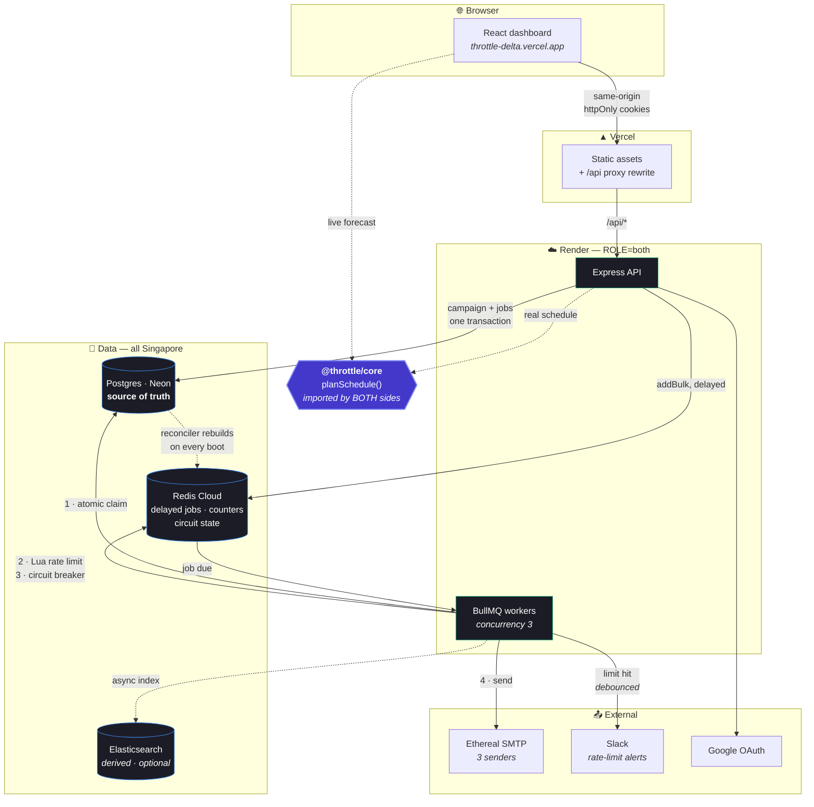
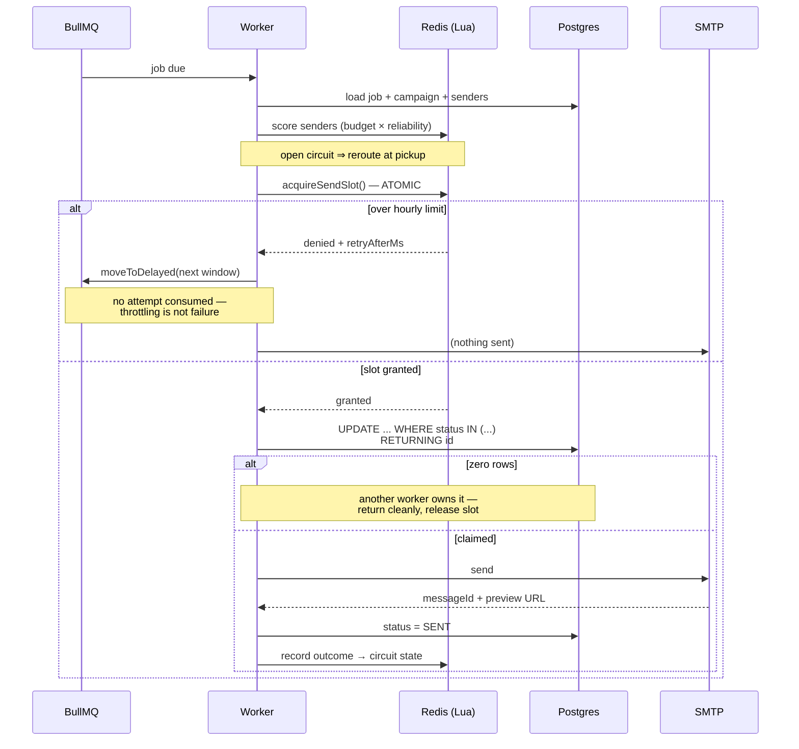

# Throttle

**A production-grade email job scheduler.** Accepts campaigns over an API, spreads them
across multiple senders under per-sender hourly rate limits, sends via SMTP, survives
restarts without losing or duplicating a single send, and exposes a dashboard for all
of it.

Built for the ReachInbox full-stack assignment.

---

### 🔗 Live

| | |
|---|---|
| **Dashboard** | **<https://throttle-delta.vercel.app>** |
| API | <https://throttle-api-9jxt.onrender.com/healthz> |
| Queue dashboard | `/admin/queues` — requires an ADMIN session |

**Sign in with any Google account.** Each account gets its own isolated workspace with
three working Ethereal senders provisioned automatically, so there is nothing to
configure before scheduling. Emails are sent to Ethereal, which renders them at a
preview URL and never delivers them — every Sent row links to the real message.

> Hosted on free tiers. The API sleeps after 15 minutes idle, so the **first request may
> take up to a minute** while it wakes. Nothing is lost while it sleeps: the scheduler
> reconciles against Postgres on boot and re-spaces any overdue backlog.
>
> **The deployed instance schedules but cannot send.** Render blocks outbound traffic
> to SMTP ports 25, 465 and 587 on free web services (since 26 Sept 2025), and blocks
> them silently — the connection is dropped rather than refused, so every send times
> out. Campaigns still plan, queue, rate-limit, defer and survive restarts there; only
> the SMTP hop fails. Sending is demonstrated against a local instance, where it works
> against both Ethereal and a real Gmail sender. Any paid Render instance unblocks 465
> and 587 with no code change.
>
> Worth noting what this accidentally proved: when every sender started timing out, the
> circuit breaker opened one after five consecutive failures, traffic was rerouted, and
> all queued jobs were deferred rather than dropped. The failure path was exercised by a
> real outage rather than a staged one.
>
> **Search on the live URL runs the Postgres fallback**, not Elasticsearch — there is no
> free managed Elasticsearch tier in 2026 (Bonsai starts at $15/mo; Elastic Cloud is a
> 14-day trial). The indexing and search code is complete and is demonstrated against a
> real local cluster in the video. The dashboard labels the degraded mode rather than
> hiding it. See [docs/08-ELASTICSEARCH.md](docs/08-ELASTICSEARCH.md).

---

### [Watch the full tour with sound — brag.mp4](brag-output/brag.mp4) &nbsp;&middot;&nbsp; 61 seconds


**Covered in the tour:** Google login &rarr; dashboard &rarr; compose with CSV upload
&rarr; **the Delivery Planner** &rarr; the shared `planSchedule()` &rarr; sending with
Ethereal previews &rarr; the rate limit and the **live Slack alert** &rarr; the **circuit
breaker rerouting a failed sender** &rarr; surviving a restart &rarr; Elasticsearch search
and the live queue dashboard.

The Slack and circuit-breaker scenes show real evidence rather than a mock-up: the
`delivered: true` worker log from an actual alert, and the sender states captured during
an unplanned SMTP outage that opened a breaker for real.

---



> **Two arrows carry most of the design.** `planSchedule()` is imported by the browser
> *and* the server, so the forecast a user sees is produced by the function that does
> the scheduling. And Postgres rebuilds Redis on every boot, which is why a restart —
> or a wiped Redis — loses nothing.

### The send pipeline



---

## Table of contents

- [The core idea](#the-core-idea)
- [Quick start](#quick-start)
- [Setting up Google, Slack and Ethereal](#setting-up-google-slack-and-ethereal)
- [Architecture](#architecture)
  - [How scheduling works](#how-scheduling-works)
  - [How restart persistence works](#how-restart-persistence-works)
  - [How rate limiting and concurrency work](#how-rate-limiting-and-concurrency-work)
  - [How duplicates are prevented](#how-duplicates-are-prevented)
- [Standout features](#standout-features)
- [Features implemented](#features-implemented)
- [Security](#security)
- [Behaviour under load](#behaviour-under-load)
- [Testing](#testing)
- [Assumptions, shortcuts and trade-offs](#assumptions-shortcuts-and-trade-offs)

---

## The core idea

> **Plan at schedule time. Guard at send time.**

The obvious way to build this is *reactive*: a job wakes up, checks a counter, bounces
if it is over the limit. That works, but it has three problems — it thundering-herds
(1,000 jobs wake, 950 bounce), it scrambles delivery order, and it makes any "forecast"
feature impossible, because nothing is decided until runtime.

Throttle inverts it:

1. **At schedule time**, [`planSchedule()`](packages/core/src/planner.ts) deterministically
   assigns every recipient a sender, an hour window and an exact `scheduledAt`. Those go
   into Postgres, and into BullMQ as delayed jobs.
2. **At send time**, the worker re-checks an atomic Redis token bucket. This is a
   *guard*, not a planner — it only fires when reality has drifted from the plan
   (a retry, a circuit-breaker reroute, a second campaign sharing a sender).

`planSchedule()` is a **pure function in a shared workspace package**, imported by both
the Express API and the React compose form. So the forecast a user sees before clicking
Schedule is not an approximation of what will happen — it is produced by the exact
function that makes it happen.

That single decision is what makes the [Delivery Planner](#1-delivery-planner) honest
rather than decorative.

---

## Quick start

**Prerequisites:** Node 20+, Docker Desktop, and a Google Cloud project for OAuth.

```bash
# 1. Install
npm install

# 2. Configure — every variable is documented inline in the template
cp .env.example .env

# 3. Generate the four secrets .env needs
#    macOS/Linux:
openssl rand -hex 32          # run 4x: JWT_ACCESS_SECRET, JWT_REFRESH_SECRET,
                              #         ENCRYPTION_KEY, COOKIE_SECRET
#    Windows PowerShell:
#    -join ((1..64) | % { '{0:x}' -f (Get-Random -Max 16) })

# 4. Start Postgres, Redis and Elasticsearch
npm run infra:up

# 5. Create the schema, then provision three Ethereal mailboxes automatically
npm run db:migrate
npm run db:seed

# 6. Run it
npm run dev
```

| Service | URL |
|---|---|
| Dashboard | <http://localhost:5173> |
| API | <http://localhost:4000> |
| Health / readiness | <http://localhost:4000/readyz> |
| **Bull Board** (queue dashboard) | <http://localhost:4000/admin/queues> — **requires an ADMIN session** |

### Running the API and worker separately

The single `npm run dev` runs both in one process (`ROLE=both`). To run them apart —
which is how you'd deploy, and how you demonstrate that restarting the API does not
interrupt in-flight sends:

```bash
npm run dev:api    -w @throttle/api    # HTTP only
npm run dev:worker -w @throttle/api    # queue consumers only
```

To prove the rate limiter is genuinely multi-process safe, run several workers:

```bash
docker compose --profile app up --scale worker=3
```

All three share the same Redis counters, so the per-sender hourly limit holds across
all of them — that is the point of doing the check in Lua rather than in Node.

---

## Setting up Google, Slack and Ethereal

### Google OAuth (required — login is mandatory)

1. <https://console.cloud.google.com> → **APIs & Services** → **Credentials**
2. **Create Credentials** → **OAuth client ID** → **Web application**
3. Under **Authorised redirect URIs**, add *exactly*:
   ```
   http://localhost:4000/api/auth/google/callback
   ```
4. Copy the client ID and secret into `GOOGLE_CLIENT_ID` / `GOOGLE_CLIENT_SECRET`.

> The redirect URI must match character for character, including the scheme and port.
> A mismatch produces Google's `redirect_uri_mismatch` error, which is the single most
> common setup failure.

**Tenant assignment:** users are grouped into a workspace by email domain, and the first
user in a workspace becomes its `ADMIN`. Public domains (gmail.com, outlook.com, …) get
a *private* workspace per user, so signing in with a personal address never drops you
into a shared workspace with strangers.

**This means anyone can sign in and use the app immediately.** One person being ADMIN of
their own workspace does not lock anyone else out — each Google account gets its own
isolated workspace, and **three Ethereal senders are provisioned automatically on first
login** so there is nothing to configure before scheduling. See
[trade-offs](#assumptions-shortcuts-and-trade-offs).

### Slack (required for the rate-limit notification)

1. <https://api.slack.com/apps> → **Create New App** → **From scratch**
2. **OAuth & Permissions** → **Bot Token Scopes** → add `incoming-webhook` and `chat:write`
3. **Redirect URLs** → add *exactly*:
   ```
   http://localhost:4000/api/slack/callback
   ```
4. Copy **Client ID**, **Client Secret** and **Signing Secret** into `.env`.
5. In the dashboard, click **Connect Slack**, pick a channel, approve.

A test message is posted the moment you connect, so you get immediate proof it works
rather than discovering it is broken when a real alert silently fails.

If Slack is **not** connected, rate-limit hits simply do not notify — no crash, no error.
Connect it later and notifications start working with **no redeploy**, because the
worker reads the installation from the database on every notification rather than
caching it at boot.

### Senders and who can add them

Every workspace gets **three Ethereal senders provisioned automatically on first
login**, so a new account can schedule immediately with nothing to configure.

Real SMTP senders are added from the dashboard: **Sender health → Add sender**, with
presets for Gmail, Brevo and Ethereal. The server opens a real SMTP connection and
verifies the credentials *before* saving, so a typo fails at the form rather than
three hours later when the first scheduled send silently fails. Passwords are
encrypted with AES-256-GCM and never returned by the API — `SenderDto` has no
password field, so they cannot be serialised by accident.

**Who can add one:**

| Signs in with | Workspace | Role | Can add senders |
|---|---|---|---|
| A personal domain (gmail.com, outlook.com, …) | their own, private | ADMIN | yes |
| First user on a custom domain | new, named for the domain | ADMIN | yes |
| Later users on that domain | joins the existing one | MEMBER | no |

Anyone signing in with a personal address therefore gets their own workspace and can
add their own sending identity straight away. The restriction only bites inside a
shared company workspace, and it is deliberate: without it, anyone who obtained an
address at that domain could add an identity that sends as the organisation.
Promoting a member to ADMIN currently requires a direct database change.

> **Known limitation.** Real senders authenticate with SMTP credentials — for Gmail,
> a 16-character App Password. That means asking a user to hand over a credential
> with full send access to their mailbox, which is a significant trust ask for
> something a demo does not need.
>
> A production system would use Google OAuth with the `gmail.send` scope instead: the
> user approves once, the app stores a refresh token, and no password is ever entered.
> That was not built here because the brief specifies Ethereal as the SMTP provider,
> and Ethereal needs no such flow.
>
> **Reviewers do not need to add anything.** The auto-provisioned Ethereal senders
> work out of the box, and every sent message links to its rendered preview.

### Ethereal (fake SMTP)

Nothing to do — `npm run db:seed` provisions three Ethereal mailboxes via the Nodemailer
API and prints their credentials. Ethereal accepts mail and renders it at a preview URL
but never actually delivers it, which is what makes it safe to fire a thousand test
emails at.

Every sent email in the dashboard carries a **View email ↗** link to its Ethereal preview
— that is the proof a send really happened.

To pin specific accounts instead, create them at <https://ethereal.email/create> and fill
in the `SMTP_*` block in `.env`.

---

## Architecture

### How scheduling works

```
POST /api/campaigns
      │
      ├─▶ 1. Resolve senders          authoritative; the client's list is not trusted.
      │                                 The campaign's hourlyLimit is a CEILING on each
      │                                 sender's own limit, never a raise.
      │
      ├─▶ 2. planSchedule()           pure function, no clock, no I/O.
      │                                 Deals recipients round-robin across senders, then
      │                                 walks each sender's time cursor forward, rolling
      │                                 into the next wall-clock hour when it exhausts
      │                                 that window's quota or runs out of wall time.
      │
      ├─▶ 3. Postgres transaction     campaign row + every EmailJob row, atomically,
      │                                 in chunks of 1,000.
      │
      └─▶ 4. BullMQ addBulk           delayed jobs, jobId = EmailJob id.
                                        AFTER the transaction commits — see below.
```

**Why step 4 must follow step 3:** enqueuing first would let a worker pick up a job whose
row does not exist yet. The worker would find nothing, log a warning, and the email would
silently never send. Committing first means the worst case is a job that exists in
Postgres but not Redis — which the reconciler repairs automatically.

**Window alignment is the subtle part.** Hour windows are aligned to **wall-clock UTC
hours**, not to the campaign start time, because the Redis rate-limit key is
`floor(epochMs / HOUR_MS)`. Both the planner and the limiter import `hourWindowStart()`
from [`packages/core/src/time.ts`](packages/core/src/time.ts) — that shared import is
what keeps the forecast and the enforcement describing the same reality. Align the
planner to `startAt` instead and the two silently desynchronise.

A consequence: a campaign starting at 10:45 gets only 15 minutes of the 10:00 window.
The planner accounts for this and warns about it, which is why the first bar in the chart
is often shorter than the rest.

### How restart persistence works

Three distinct failure modes, each needing a different fix:

| # | What happened | Symptom | Fix |
|---|---|---|---|
| A | Process killed mid-send | Row stuck in `SENDING`, `lockedAt` never clears | **Reaper** |
| B | Redis lost data | Postgres has `SCHEDULED` rows, Redis has no jobs — emails silently never send | **Reconciler** |
| C | Process was simply down | Jobs became due while offline | BullMQ handles it natively; the reconciler re-spaces the backlog |

Both run at boot (`runStartupRecovery()`) **before the worker consumes anything**, and
then continuously.

**The reconciler's trick:** rather than checking each job's existence in Redis (one
round-trip per job — unusable at 50k jobs), it *blindly re-adds* them. BullMQ ignores an
`add()` whose `jobId` already exists, so re-adding is a cheap no-op for the common case
and a repair for the rare one. The safe operation and the fast operation are the same
operation.

**Overdue jobs are re-spaced, not dumped.** After an hour of downtime hundreds of jobs are
due simultaneously; releasing them together would have them all hit the rate limiter and
bounce in lockstep. The reconciler spaces them by the campaign's own gap so the backlog
drains at the intended rate.

**Redis persistence:** `docker-compose.yml` starts Redis with `--appendonly yes`. This is
not optional — the default RDB snapshotting can lose the last seconds of writes on a hard
kill, and since delayed jobs *are* the schedule, that is data loss on exactly the restart
scenario this has to survive. The API also checks this at boot and warns loudly if it is off.

#### ❌ No cron. Anywhere.

No `node-cron`, `agenda`, `bree`, or OS `crontab`. **BullMQ's `repeat:` option is also
avoided deliberately** — it is backed by cron expressions.

Recurring work (reconciler, reaper, token pruning) uses a **self-chaining delayed job**:
each run finishes by enqueuing its own successor with a delay. That is an ordinary
delayed job that happens to schedule its next run. It survives restarts because the
successor is persisted in Redis before the current run completes, and `startMaintenanceChain()`
re-seeds it at boot if it is ever lost.

A deterministic `jobId` per iteration means several worker instances starting at once
produce **one** chain, not one chain each.

### How rate limiting and concurrency work

**The problem.** N workers, each with M concurrent jobs, all want to send from the same
sender. Every one reads "sent 199 of 200", every one concludes it has room, and 5 emails
go out over the limit. That is a read-modify-write race, and no amount of application-level
care fixes it. In-memory counters are worse — two API instances each allow 200/hour and
the real rate is 400/hour.

**The fix.** Every check-and-increment is a **single Lua script**. Redis executes Lua
atomically — nothing interleaves between the read and the write. Correctness therefore
holds for any number of workers, processes or machines.

[`rateLimiter.ts`](apps/api/src/scheduler/rateLimiter.ts) checks three things in one
round-trip:

1. Tenant-wide hourly ceiling (`MAX_EMAILS_PER_HOUR_GLOBAL`, 0 = disabled)
2. Per-sender hourly ceiling (`MAX_EMAILS_PER_HOUR_PER_SENDER`)
3. Minimum gap since that sender's last send (`MIN_DELAY_BETWEEN_EMAILS_MS`)

Counters are keyed `throttle:rl:{tenantId}:{senderId}:{hourWindowKey}` with a 2-hour TTL —
outliving their window so a late job from a paused worker sees the correct count rather
than a fresh zero.

| Setting | Default | Meaning |
|---|---|---|
| `WORKER_CONCURRENCY` | `5` | Jobs in parallel per worker process |
| `MIN_DELAY_BETWEEN_EMAILS_MS` | **`2000` (2 seconds)** | Minimum gap between sends *from the same sender* |
| `MAX_EMAILS_PER_HOUR_PER_SENDER` | `200` | Per-sender hourly ceiling |
| `MAX_EMAILS_PER_HOUR_GLOBAL` | `0` (off) | Optional tenant-wide ceiling |

**The chosen delay is 2 seconds**, the figure quoted in the brief. It is enforced in Redis,
not with `setTimeout`, so it holds across worker processes — a `setTimeout` in one Node
process says nothing about what four other processes are doing.

**Concurrency is safe to raise.** Correctness under parallelism comes from the atomic DB
claim and the Lua limiter, not from keeping concurrency low.

**Being throttled is not a failure.** A rate-limited job is moved via `moveToDelayed()`,
which **does not consume a BullMQ retry attempt**. Throwing instead would burn the retry
budget on being throttled and eventually mark a perfectly good email as permanently
failed — precisely the "do not drop or permanently fail jobs" the brief forbids. The job
is pushed into the next window with its `sequenceNo` preserved, so ordering survives.

**Slack alert, debounced.** When a sender hits its limit with 1,000 jobs queued behind it,
every one of those jobs independently discovers the limit. A naive implementation sends
1,000 Slack messages. `SETNX` on a key embedding the hour window means exactly **one**
alert per sender per window — atomic, so concurrent workers cannot both pass the check.

### How duplicates are prevented

Three independent layers:

| Layer | Mechanism | Catches |
|---|---|---|
| 1 | BullMQ `jobId` = EmailJob id | The same job enqueued twice (retried API call, reconciler, pump) |
| 2 | **Atomic DB claim** | Two workers racing for the same job |
| 3 | `@@unique([campaignId, recipientEmail])` | Anything that reaches the database |

Layer 2 is the one that matters at send time:

```sql
UPDATE email_jobs
   SET status = 'SENDING', attempts = attempts + 1,
       "lockedAt" = NOW(), "lockedBy" = $worker
 WHERE id = $1 AND status IN ('SCHEDULED','QUEUED','RESCHEDULED')
RETURNING id
```

Postgres guarantees only one concurrent transaction can match that `WHERE` and transition
the row. The loser gets zero rows back and returns cleanly. It is raw SQL because Prisma
has no primitive for `UPDATE ... WHERE <status guard> RETURNING *`, and this statement is
the single thing standing between us and a double send.

Plus an `Idempotency-Key` header on `POST /api/campaigns`, so a retried request returns
the original campaign rather than scheduling a second one.

---

## Standout features

### 1. Delivery Planner

Before you click Schedule, the compose form shows a live forecast:

> **1,000 emails · 3 senders · 150/hour · 7 windows · finishes in 6h 40m**

…with a stacked bar chart of emails per hour window, segmented by sender, and a dashed
reference line marking capacity.

**Why it is not just a chart:** it calls the same `planSchedule()` the backend calls.
There is no second implementation to drift. It also turns the brief's "behaviour under
load" requirement into something you can *see* — schedule 1,000 emails against 3 senders
at 50/hour and watch them spread across 7 windows before anything is sent.

The chart's colour palette was **run through a validator**, not chosen by eye — it clears
the colourblind-separation, lightness-band, chroma and contrast gates against this app's
actual dark surface. Every sender is also named in the legend, so identity never depends
on colour alone, and a "View as table" disclosure gives the same data non-visually.

### 2. Health-aware sender rotation with a circuit breaker

Plain round-robin keeps handing work to a sender whose SMTP credentials were just revoked.
Every send burns retry budget and, with a real provider, damages domain reputation — and
the failure is silent, because the queue drains and the dashboard shows activity.

Instead each sender is scored:

```
healthScore = remainingHourlyBudget × (1 − recentFailureRate)
```

Multiplying matters. Budget alone picks a fresh-but-broken sender over a busy-but-healthy
one; reliability alone piles everything onto one sender until it hits its limit.

```
CLOSED ──(N consecutive failures)──▶ OPEN
OPEN ──(cooldown)──▶ HALF_OPEN ──(M successes)──▶ CLOSED
                          └──(any failure)──▶ OPEN
```

`HALF_OPEN` admits **one probe at a time**. Without that lock, the moment a cooldown
expires every waiting worker probes simultaneously — exactly the hammering the breaker
exists to prevent.

**Reroutes happen at job pickup, not by rewriting queued jobs.** Mutating thousands of
delayed Redis jobs is slow and racy (a job can be picked up mid-rewrite). Re-deciding at
pickup is one atomic read and is always based on current truth. The job records
`plannedSenderId` vs `actualSenderId`, so the dashboard shows a **"rerouted from X"** badge
— the breaker's most important behaviour made visible.

All state transitions happen inside Lua, so concurrent workers cannot interleave a
read-modify-write and lose a state change.

---

## Features implemented

### Backend

| Requirement | Status | Where |
|---|:--:|---|
| Accept scheduling requests via API | ✅ | [`routes/campaigns.ts`](apps/api/src/routes/campaigns.ts) |
| Store in a relational DB | ✅ | Postgres + Prisma — [`schema.prisma`](apps/api/prisma/schema.prisma) |
| BullMQ delayed jobs, **no cron** | ✅ | [`queues/index.ts`](apps/api/src/queues/index.ts) |
| Multiple senders via Ethereal SMTP | ✅ | [`mailer/`](apps/api/src/mailer/), pooled transports |
| Elasticsearch indexing & search | ✅ | [`search/`](apps/api/src/search/) — **scheduled AND sent** indexed, Postgres fallback, [setup](docs/08-ELASTICSEARCH.md) |
| Live BullMQ dashboard | ✅ | Bull Board at `/admin/queues`, **ADMIN-gated** |
| Survives restart, correct timing | ✅ | [`scheduler/maintenance.ts`](apps/api/src/scheduler/maintenance.ts) |
| No duplicates / idempotent | ✅ | Three layers — see above |
| Configurable worker concurrency | ✅ | `WORKER_CONCURRENCY` |
| Minimum delay between sends | ✅ | **2s** default, Redis-enforced |
| Emails per hour, per sender | ✅ | Atomic Lua token bucket |
| Multi-worker / multi-instance safe | ✅ | All check-and-increment in Lua |
| Never drop jobs on limit | ✅ | `moveToDelayed()`, no attempt consumed |
| Slack OAuth + live alert on limit | ✅ **verified live** | [`slack/service.ts`](apps/api/src/slack/service.ts) — real message delivered, debounced |
| Slack disconnect / reconnect | ✅ | Soft-deactivate; read per-notification, no redeploy |

### Frontend

| Requirement | Status |
|---|:--:|
| Real Google OAuth login | ✅ authorization code + PKCE, backend-owned |
| Header with name, email, avatar | ✅ |
| Logout | ✅ |
| Scheduled / Sent tabs | ✅ |
| Compose New Email button | ✅ |
| Subject + body | ✅ with `{{merge}}` fields |
| CSV/TXT upload with detected count | ✅ parsed client-side *and* re-parsed server-side |
| Start time, delay, hourly limit | ✅ |
| Scheduled table (email/subject/time/status) | ✅ |
| Sent table (email/subject/time/status) | ✅ + Ethereal preview link |
| Loading states | ✅ skeletons |
| Empty states | ✅ distinct per tab and for search |
| Error handling | ✅ toasts, field-level errors, retry |
| Reusable components | ✅ [`components/ui/`](apps/web/src/components/ui/) |
| **Matches the provided Figma** | ✅ light theme, green accent, sidebar layout, full-page compose |
| TypeScript types for API | ✅ imported from `@throttle/core` — no duplication |
| ⭐ Delivery Planner | ✅ |
| ⭐ Sender health / circuit breaker panel | ✅ |

---

## Security

Full threat model: **[docs/04-SECURITY.md](docs/04-SECURITY.md)**. Summary:

- **Nothing is public.** Every route requires a session except `/healthz`, `/readyz`,
  `/api/config` and the two OAuth callbacks (which are protected by single-use `state`).
  This is **enforced by a test** that walks the real Express router stack and fails CI if
  an unguarded route appears — [`routeSecurity.test.ts`](apps/api/src/routes/routeSecurity.test.ts).
- **Bull Board is ADMIN-gated**, and the flag **fails closed** if unset. It exposes
  recipient addresses and allows retrying/deleting jobs; it is the endpoint most often
  left wide open.
- **Sessions:** 15-minute access JWT + rotating refresh token, both `httpOnly`. Refresh
  tokens are stored hashed with **reuse detection** — replaying a rotated token revokes
  the whole family.
- **Tenant isolation** on every query, from the session, never from the request.
  `searchEmailsSchema` deliberately has no `tenantId` field, so the IDOR is impossible by
  construction.
- **Secrets at rest:** SMTP passwords and Slack tokens encrypted with AES-256-GCM.
- **CSRF:** double-submit token on all mutating requests.
- **Config validation:** the process refuses to boot on invalid config rather than
  silently defaulting to a wrong rate limit.

---

## Behaviour under load

**1,000+ emails scheduled for the same time.** `planSchedule()` spreads them across hour
windows at creation — they are never all due at once. With 3 senders at 50/hour: 7 windows,
150/hour, finishing in about 6h40m. You see this in the chart *before* scheduling.

**Rate limit exceeded.** Jobs are `moveToDelayed()`-ed into the next window with
`sequenceNo` preserved. Nothing is dropped, nothing permanently fails, no retry attempt is
consumed. One Slack alert fires per sender per window.

**All senders exhausted or circuit-open.** The job defers to the next window rather than
failing.

**Memory.** Campaigns are fully materialised up front — all delayed jobs enqueued at
creation. At the 50,000-recipient cap that is roughly 20–25 MB of Redis, which is fine.
A **campaign pump** (incremental materialisation beyond ~5,000 recipients) is wired into
the queue and config for the next order of magnitude, but **its handler is currently a
stub** — nothing above the threshold behaves differently yet. Honest status:
[docs/06-DEVLOG.md § Open items](docs/06-DEVLOG.md#open-items).

See [docs/05-SCALABILITY.md](docs/05-SCALABILITY.md) for the 1k / 100k / 1M analysis and
where the first real bottleneck actually is.

---

## Testing

```bash
npm test                              # everything
npx vitest run --root packages/core   # 25 planner tests
npx vitest run --root apps/api        #  7 route-security tests
npm run typecheck                     # all three packages, strict
```

**32 tests, all passing.** The planner suite encodes the brief's own example as an
executable assertion:

```ts
it('spreads 1,000 leads across exactly 7 hour windows', () => {
  expect(plan.windowCount).toBe(7);   // 1000 leads / 3 senders @ 50/hr
});
```

…plus determinism (the property the whole Delivery Planner rests on), per-window limit
enforcement, gap enforcement, wall-clock window alignment, partial first windows, load
balancing, and ordering guarantees.

The route-security suite was **verified to actually fail** when an unguarded route is
introduced — an earlier version passed vacuously, which is recorded in
[docs/06-DEVLOG.md](docs/06-DEVLOG.md).

---

## Assumptions, shortcuts and trade-offs

**Assumptions**

1. **Tenancy is by email domain.** Everyone at `acme.com` shares a workspace; the first
   user becomes ADMIN. Public domains get a private workspace each. *A real product needs
   explicit invitations* — domain auto-join means anyone who can get an address at the
   domain joins the workspace.
2. **Senders are auto-provisioned on first login.** Every new workspace gets three
   Ethereal mailboxes so it is usable immediately. This is safe only because Ethereal
   never delivers mail; a production system would require the user to connect their own
   SMTP credentials before sending anything.
2. **A failed send consumes its rate-limit slot.** Real providers count connection
   attempts, so this is realistic and conservative, but a retried send consumes two slots.
3. **The reaper does not decrement `attempts`.** A crash mid-send might have happened
   *after* SMTP accepted the message; treating it as a free retry risks a duplicate. Worst
   case, an email gets one fewer retry than configured.
4. **Merge fields are string substitution, not a template engine.** Handlebars/EJS would
   execute code from a user-supplied campaign body — server-side template injection for a
   feature that only needs string replacement.

**Shortcuts**

1. **CSV parsing is not full RFC 4180** — quoted fields with embedded delimiters work;
   embedded *newlines* inside quotes do not.
2. **No campaign editing.** Campaigns can be created and cancelled, not modified.
   Re-planning a partially-sent campaign is a genuinely hard problem.
3. **Elasticsearch security is disabled in local Docker.** Fine for local dev; production
   needs TLS + API keys + network isolation.
4. **No E2E browser tests.** Unit tests cover the planner and route security; the
   integration path was verified manually.
5. **Sender management is API-only in the UI** — seeding creates them, and the dashboard
   displays health, but there is no add-sender form. The endpoint exists and is ADMIN-gated.

**Trade-offs**

| Decision | Alternative | Why this way |
|---|---|---|
| Plan at schedule time | React at send time | Makes the forecast truthful and preserves ordering; costs a bigger write at creation |
| Reroute at pickup | Rewrite queued jobs | Atomic and always current; the queued job's `plannedSenderId` becomes advisory |
| Blind re-enqueue in reconciler | Check each job first | O(1) instead of O(n) round-trips; relies on BullMQ jobId dedup |
| Prisma + raw SQL for the claim | Pure Prisma | Prisma cannot express the compare-and-swap that prevents double sends |
| Elasticsearch optional | Hard dependency | Search being down must not stop email from sending |
| Dark theme only | Light + dark | Matches the product's visual language; tokens are defined so light is a small change |

---

## Documentation

| Document | Contents |
|---|---|
| [00-PROJECT-OVERVIEW.md](docs/00-PROJECT-OVERVIEW.md) | **Start here** — status, repo map, where each requirement lives |
| [01-PLAN.md](docs/01-PLAN.md) | Phased build plan with checkpoints |
| [02-TECH-STACK.md](docs/02-TECH-STACK.md) | Every dependency and why it was chosen |
| [03-ARCHITECTURE.md](docs/03-ARCHITECTURE.md) | Deep dive: data flow, state machines, key design decisions |
| [04-SECURITY.md](docs/04-SECURITY.md) | Threat model, endpoint-by-endpoint posture |
| [05-SCALABILITY.md](docs/05-SCALABILITY.md) | Behaviour at 1k / 100k / 1M, and the real bottlenecks |
| [06-DEVLOG.md](docs/06-DEVLOG.md) | **What broke and how it was fixed** |
| [07-SETUP-CLOUD.md](docs/07-SETUP-CLOUD.md) | Running against Neon + Redis Cloud without Docker |
| [08-ELASTICSEARCH.md](docs/08-ELASTICSEARCH.md) | What is indexed and when; free hosted setup |
